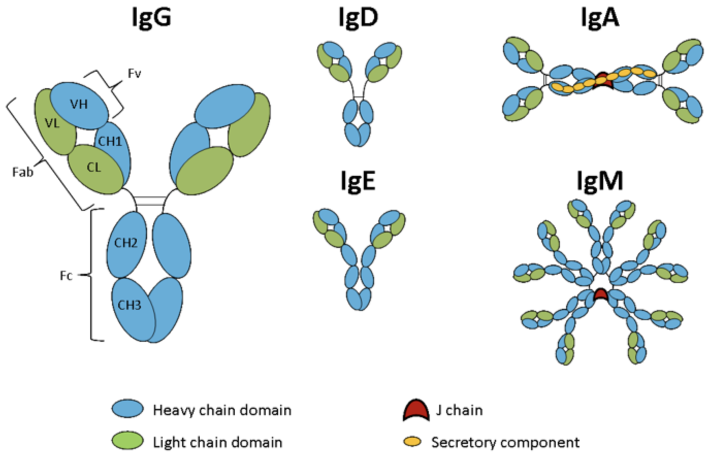

Bienvenido! I am a PhD student at Johns Hopkins University using deep learning and data science principles to push advancements in de novo protein design.

I am passionate about ... My research ...

**What keeps me up at night:** 
  - **Antibody design**: ?
  - **Deep Learning Representations**: ?
  - **Membrane Proteins**: ?

Feel free to check out [info about me](name.md), details about [current research](name2.md), and my passionate side hobby [teaching tutorials](name3.md)

  

